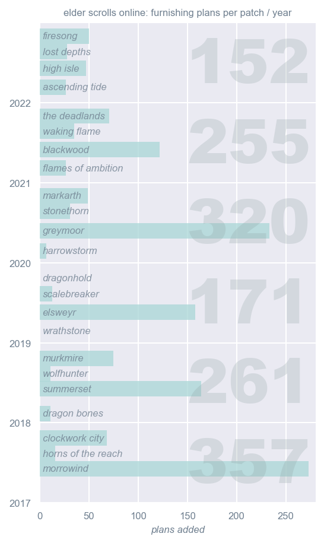
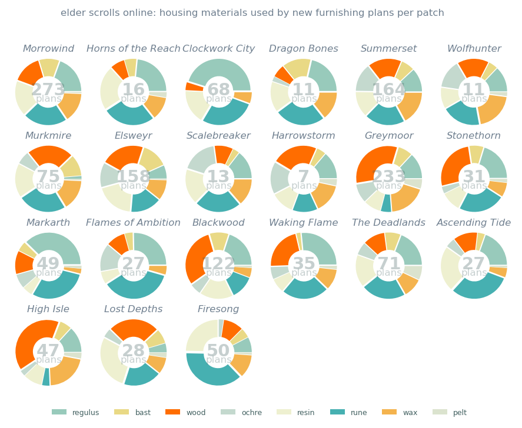
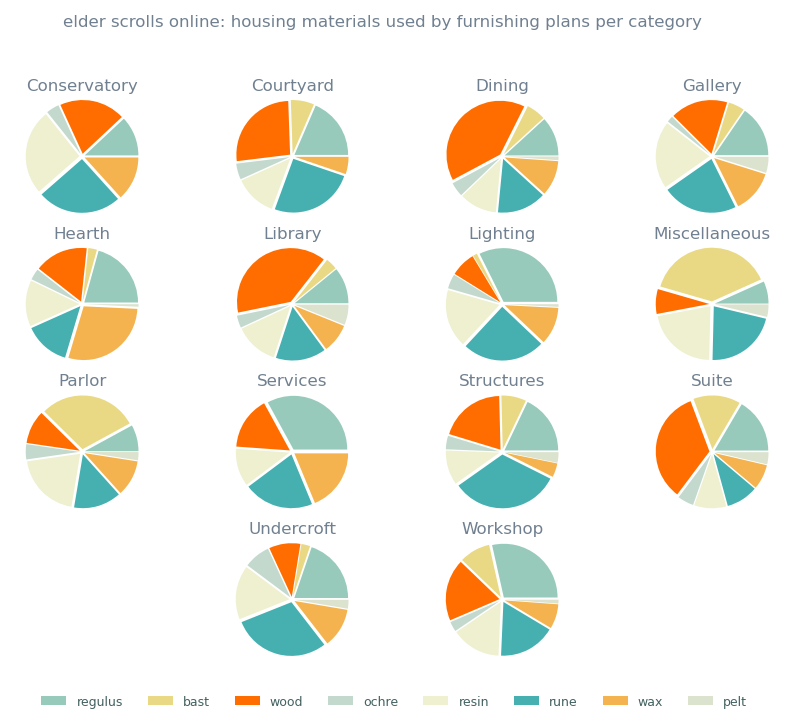

# Elder Scrolls Online: Furnishing Plan Materials

## Introduction


In my [ESO Crafting Materials](https://github.com/racheldelong/ESO-Crafting-Material-Prices) project for Code Kentucky Data Analysis 1, I found that most furnishing material price increases began in the weeks between the start of public testing and the official release of new content patches in The Elder Scrolls Online.

For my Data Analysis 2 project, I'm going to focus on the relationship between past content updates in *The Elder Scrolls Online* and the furnishing materials required to craft new plans added by each, and the impact each patch would likely have on demand.


__Objective:__ analyze the likely impact of furnishing plans added per patch on the price of furnishing materials in The Elder Scrolls Online.


__Statement of Work:__ Create a dataframe of furnishing plans from The Elder Scrolls Online. For each plan, find which patch added it to the game, which housing materials it requires, and the furnishing category of the item crafted. Compare the impact of past patches on housing material demand.


---

## Requirements

This project uses Python 3.9.15


__Packages:__

- pandas
- matplotlib
- beautifulsoup4
- requests
- jupyter notebook

## Setup

1. Download zip or clone ESO-Plan-Mats repository:

```
git clone https://github.com/racheldelong/ESO-Plan-Mats.git
```

2. To set up [conda](https://conda.io/projects/conda/en/latest/user-guide/install/index.html) environment, navigate to the ESO-Plan-Mats folder in Anaconda Prompt and enter:

```
conda env create -f environment.yml
```


3. After environment is created, activate by entering:

```
conda activate esoplans
```

4. Start Jupyter notebook from Anaconda Prompt by entering:

```
jupyter notebook
```

5. Click 'ESOPlanMats.ipynb' to open project notebook.

---

## Data Sources

- Tsu's Magical Pricing Assistant, Furniture Catalog [link](https://docs.google.com/spreadsheets/d/1gA3gLV_trvozQjHANvCWIrzmCMhEGdf6dm7N_U2CYuY/)

- ESO Furnishings Helper by Sapphire_Ocelot, Plans [link](https://docs.google.com/spreadsheets/d/11XxNt07znE3cHqWMecO-NxSjNWWnaA8hMA6uDV_53O8/)

- The Unofficial Elder Scrolls Pages [UESP.net](https://en.uesp.net/wiki/Main_Page)

- ESO-Hub.com (new plan details) [ESO-Hub.com](https://eso-hub.com/en/housing)

---

## Project Plan


### __Feature 1: Loading data.__

Read three spreadsheets from Google Sheets, and scrape data from UESP.net and ESO-HUB.com to get a list of newly added furnishing plans and fill out the data for each.

### __Feature 2: Clean and operate on the data while combining them.__ 

Merge the patch data from ESO Furnishings Helper with the plan materials in Tsu's Magical Pricing Assistant. 

Remove any duplicate plans, and use pandas concatenate to combine with web scraped plan data.

Find the sum of housing materials required to craft each plan and the total plans added per content patch, and merge with the patch information dataframe.

### __Feature 3: Visualize / present your data.__ 

Create three figures with matplotlib:

- a horizontal bar graph of the number of plans released per update & year
- pie charts for the ratio of housing materials required to craft plans added in each update 
- pie charts for crafting materials per plan category

### __Feature 4: Best practices.__ 

Use a conda environment and included instructions for setup.

---

## __Figures__



---




---

__Changes to Project Plan:__

*Original project was going to analyze Tales of Tribute card game matches. Changed project to ESO Furnishing Plan Materials to build on Data 1 project topic and have more options for datasets to meet project requirements.*


